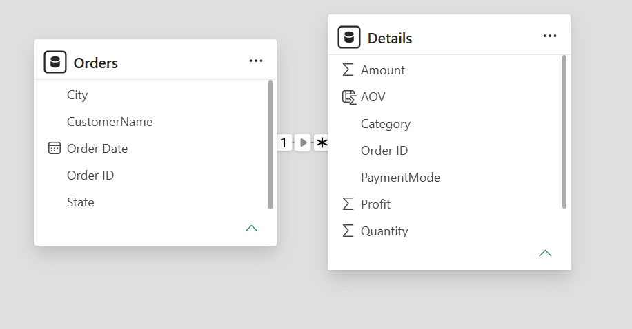

# 📊 Sales Performance Dashboard — Power BI

An interactive Power BI dashboard that analyzes sales, profit, and customer behavior across states, categories, and payment modes — built from raw order and transaction data using a star-schema data model and DAX measures.


---

## 🔍 Overview

This project transforms two raw transactional datasets (`Orders.csv` and `Details.csv`) into a clean, relational data model and a single-page executive dashboard in Power BI. It highlights key business metrics — revenue, profit, quantity sold, and average order value — and lets users slice the data by **quarter** and **state** to explore regional and seasonal trends.

## 🎯 Key Objectives

- Consolidate order-level and line-item-level data into a single analytical model
- Track overall sales performance (Amount, Profit, Quantity, AOV)
- Identify top-performing states, customers, and product categories
- Understand payment mode preferences and their impact on sales
- Spot seasonal trends in profit across months

---

## 🗂️ Dataset

| File | Description | Rows |
|------|-------------|------|
| `Orders.csv` | Order-level details — Order ID, Order Date, Customer Name, State, City | 500 |
| `Details.csv` | Line-item details — Order ID, Amount, Profit, Quantity, Category, Sub-Category, Payment Mode | 1,500 |

The two tables are joined on **Order ID** in a **one-to-many** relationship (`Orders` → `Details`), since a single order can contain multiple line items.

## 🧩 Data Model



- **Orders (1)** → **Details (\*)** — one order can have many detail records
- A DAX measure **AOV (Average Order Value)** is calculated in the `Details` table

```dax
AOV = DIVIDE([Sum of Amount], DISTINCTCOUNT(Details[Order ID]))
```

> Update this formula in the README to match your exact DAX if it differs — this is the standard AOV calculation (Total Sales ÷ Number of Orders).

---

## 📈 Dashboard Features

| Visual | Insight |
|---|---|
| **KPI Cards** | Sum of Amount, Sum of Profit, Sum of Quantity, Sum of AOV |
| **Sum of Amount by State** | Regional revenue comparison |
| **Sum of Quantity by Category** | Product category mix (Electronics, Furniture, Clothing) |
| **Profit by Month** | Seasonal profit trend, highlighting profitable vs. loss-making months |
| **Sum of Amount by Customer Name** | Top customers by spend |
| **Sum of Quantity by Payment Mode** | Preferred payment methods (COD, Debit Card, UPI, EMI, Credit Card) |
| **Sum of Profit by Sub-Category** | Most/least profitable sub-categories (e.g., Printers, Bookcases) |
| **Slicers** | Filter by Quarter (Qtr 1–4) and State |

---

## 🛠️ Tools & Technologies

- **Power BI Desktop** — data modeling, DAX, and visualization
- **Power Query** — data cleaning and transformation
- **DAX (Data Analysis Expressions)** — calculated measures
- **CSV** — raw source data

---

## 📁 Repository Structure

```
Demo-dashboard/
├── data/
│   ├── Orders.csv
│   └── Details.csv
├── screenshots/
│   ├── dashboard-preview.png
│   └── data-model.png
├── DEMO.pbix
└── README.md
```

---

## 🚀 How to Use

1. Clone this repository
   ```bash
   git clone https://github.com/Adarsh-App/Demo-dashboard.git
   ```
2. Open `DEMO.pbix` in **Power BI Desktop** (free download [here](https://www.microsoft.com/en-us/power-platform/products/power-bi/downloads)).
3. If prompted, update the data source paths to point to the `data/` folder on your machine.
4. Use the **Quarter** and **State** slicers to explore the data interactively.

---

## 💡 Key Insights

- Bihar accounted for the highest share of total sales in the filtered view (₹13K).
- Clothing is the leading category by quantity sold (58%), followed by Electronics (33%) and Furniture (9%).
- COD is the most-used payment mode (34%), followed by Debit Card (26%) and UPI (21%).
- Profit shows strong seasonality — November was the most profitable month, while May, June, and October recorded losses.
- Printers and Bookcases are the most profitable sub-categories.

---

## 📌 Future Improvements

- Add year-over-year comparison
- Include a customer segmentation (RFM) analysis
- Publish to Power BI Service and embed a live report link
- Add drill-through pages for state- and category-level deep dives

---

## 👤 Author

**Your Name**
[LinkedIn](#) · [Portfolio](#) · [Email](#)

---

## 📄 License

This project is licensed under the [MIT License](LICENSE).
